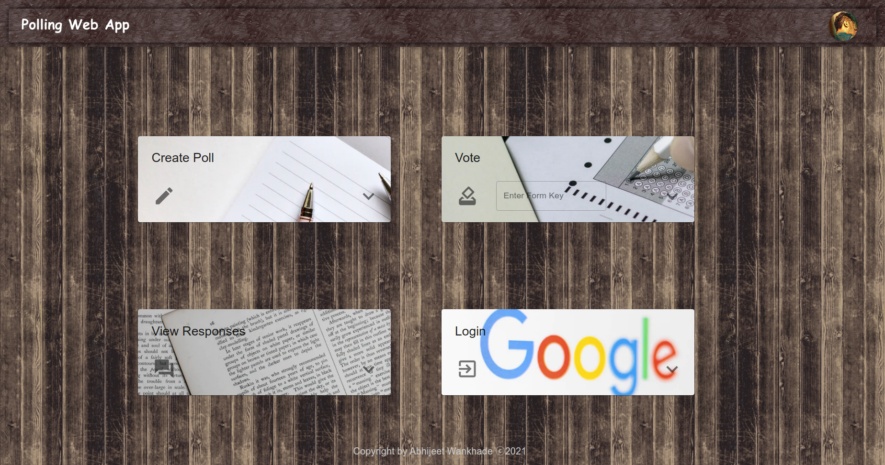
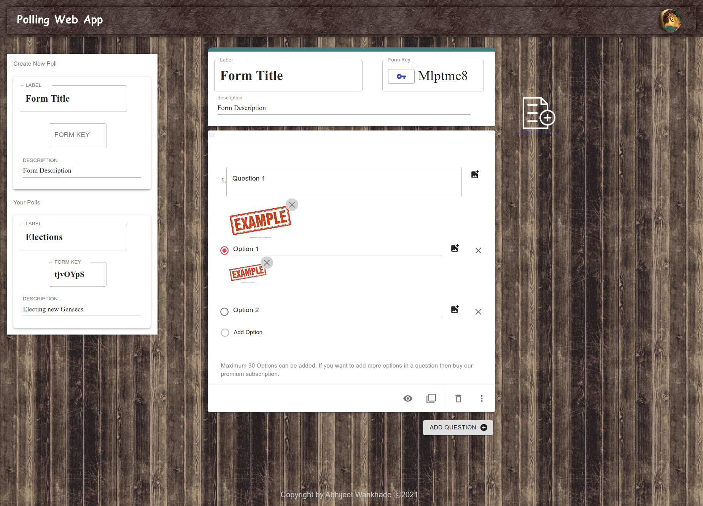

# Polling Web App using MERN Stack


Website Link : [Polling Web App](https://polling-mern-app.herokuapp.com/)

<!-- TABLE OF CONTENTS -->
<details open="open">
  <summary>Table of Contents</summary>
  <ol>
    <li>
      <a href="#about-the-project">About The Project</a>
      <ul>
        <li><a href="#built-with">Built With</a></li>
      </ul>
    </li>
    <li>
      <a href="#what-is-mern-stack">What is MERN Stack?</a>
    </li>
    <li>
      <a href="#features">Features</a>
    </li>
    <li>
      <a href="#environmental-variables">Environmental Variables</a>
    </li>
    <li>
      <a href="#how-to-build-and-run-the-project">How to Build and Run the project</a>
    </li>
    <li>
      <a href="#screenshots">Screenshots</a>
      <ul>
        <li><a href="#home-page">Home Page</a></li>
        <li><a href="#create-form">Create Form</a></li>
        <li><a href="#submit-response">Submit Response</a></li>
        <li><a href="#view-responses">View Responses</a></li>
      </ul>
    </li>
    <li>
      <a href="#scope-of-improvement">Scope of Improvement</a>
    </li>
  </ol>
</details>

---

<!-- ABOUT THE PROJECT -->

## About The Project

<table>
<tr>
<td>
This Project helps to Create Forms containing questions and their options to choose between. Each Form will get it's own unique key which will give access to people wanting to submit their responses to the poll. 
</td>
</tr>
</table>
  
### Built With
 - <a href="#what-is-mern-stack">MERN Stack</a>

---

## What is MERN Stack?

For this project, I decided to use the MERN (MongoDB, Express.js, React.js, and Node.js) technology.


- [Mongo](https://www.mongodb.com/) 4.4.0+
- [ExpressJS](https://expressjs.com/) 4.17.1+
- [ReactJS](https://reactjs.org/) 17.0.1+
- [Node](https://nodejs.org/en/) 14.15.4+ (It's recommended to use 14.15.4 LTS)

---

## Features

- Google authentication (Login and Logout with google) and authorization
- List forms created by the user
- Edit already created forms
- Submit responses to the form using form identification key
- Can add unlimited questions and maximum 30 options to each question
- Add image to questions and options (Upload images question and option wise)
- Deleteting and duplicating the question
- Drag and Drop questions to sort them accordingly
- View Responses to the form created by user on horizontal bar graph

---

## Environmental Variables

We already required and configured dotenv.

```javascript
require("dotenv").config();
```

Create a `.env` file in the root directory of the project. Add
environment-specific variables on new lines in the form of `KEY=VALUE`.
We need these environment variables:

```dosini
MONGODB_URI=mongodb connection string
REACT_APP_CLIENT_ID=google client id for OAuth
IMAGE_UPLOAD=server to upload images(ex: imgbb)
```

`process.env` now has the keys and values you defined in your `.env` file.

---

## How to Build and Run the project

1. Install NPM packages

```sh

cd Client_Side && npm install

```

2. Build React production app

```sh

cd Client_Side && npm run build

```

3. Run Server

```sh

node server.js

```

4. Run React App

```sh

cd Client_Side && npm start

```

---

## Screenshots

### Home Page



### Create Form



### Submit Response


### View Responses


---

## Scope of Improvement

- Adding a splash screen for new Users.
- Creating a sharable link for each form.
- Sharing form over different platform such as gmail, whatsapp etc..
- Using Socket.io to get realtime count of responses.
- Adding a query to who can access the form.
